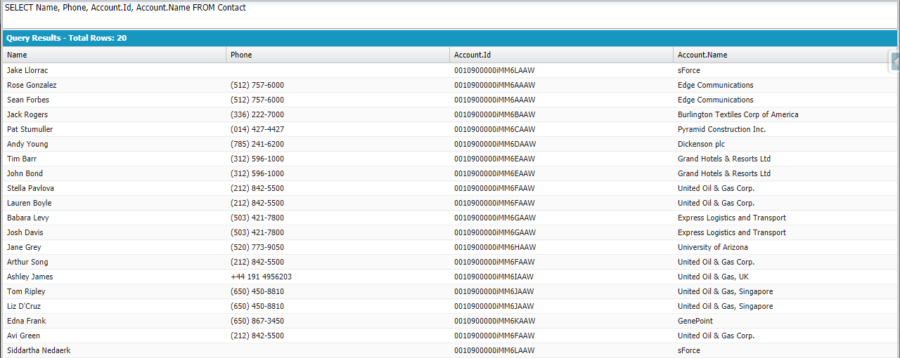
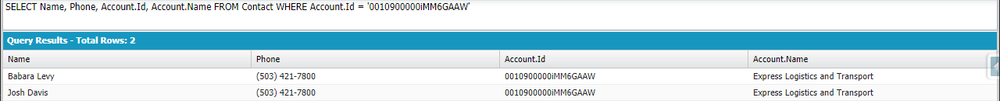
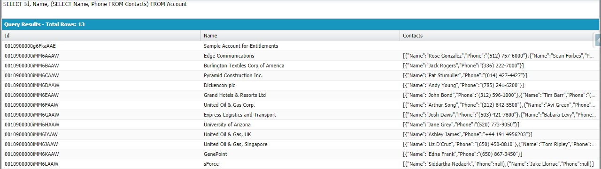
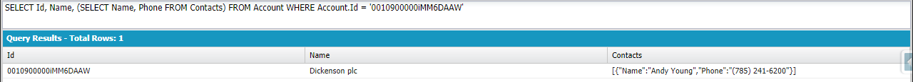
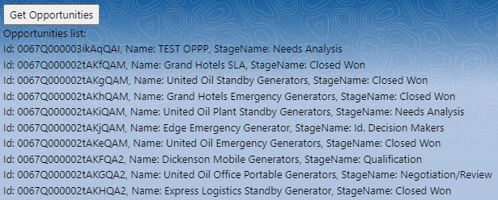
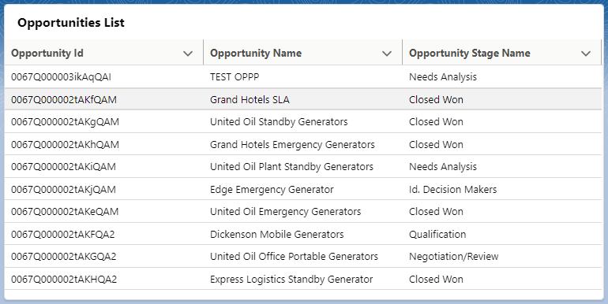

# # 1 Relationships & relationship SOQL queries examples

There are two main relationship types in Salesforce Lookup Relationship and Master-Detail relationships. There are some differences betweent these relationships:

<center>
    <table>
        <tr>
            <th>
                Lookup Relationship
            </th>
            <th>
                Master-Detail Relationship
            </th>
        </tr>
        <tr>
            <td>
                up to 25 per one object
            </td>
            <td>
                up to 2 per one object
            </td>
        </tr>
        <tr>
            <td>
                parent is not a required field
            </td>
            <td>
                parent field on a child is required
            </td>
        </tr>
        <tr>
            <td>
                deleting a parent does not delete a child
            </td>
            <td>
                deleting a parent automatically deletes a child
            </td>
        </tr>
        <tr>
            <td>
                can be multiple layers deep
            </td>
            <td>
                a child of one master detail relationship cannot be the parent of another one
            </td>
        </tr>
        <tr>
            <td>
                no impact on a security and access
            </td>
            <td>
                access to a parent determines access to a children
            </td>
        </tr>
    </table>
</center>

## Lookup relationships:

### Standard objects:

**Account** (**Parent**), **Contact** (**Child**) - Lookup field is on the **Contact** standard object | One **Account** can have 0 or many **Contacts** | One **Contact** can have 0 or one **Account**.

Child-to-parent queries:

```sql
SELECT Name, Phone, Account.Id, Account.Name FROM Contact
```



```sql
SELECT Name, Phone, Account.Id, Account.Name FROM Contact WHERE Account.Id = '0010900000iMM6GAAW'
```



Parent-to-child queries:

```sql
SELECT Id, Name, (SELECT Name, Phone FROM Contacts) FROM Account
```



```sql
SELECT Id, Name, (SELECT Name, Phone FROM Contacts) FROM Account WHERE Id = '0010900000iMM6DAAW'
```



### Custom objects:

**Vehicle** (**Parent**), **Driver** (**Child**) - Lookup field is on the **Driver** custom object | One **Vehicle** can have 0 or many **Drivers** | One **Driver** can have 0 or one **Vehicle**

Child-to-parent queries:

```sql
SELECT Name, Nationality__c, Vehicle__r.Id, Vehicle__r.Manufacturer__c FROM Driver__c
```

```sql
SELECT Name, Nationality__c, Vehicle__r.Id, Vehicle__r.Manufacturer__c FROM Driver__c WHERE Vehicle__r.Id = 'a000900000FThKjAAL'

```

Parent-to-child queries:

```sql
SELECT Id, Name, Manufacturer__c, (SELECT Name, Nationality__c FROM Drivers__r) FROM Vehicle__c
```

```sql
SELECT Id, Name, Manufacturer__c, (SELECT Name, Nationality__c FROM Drivers__r) FROM Vehicle__c WHERE Id = 'a000900000FThKjAAL'
```

Notice that it is pretty important to use **__c** suffix when you are using/querying custom object and **__r** suffix when you want to query fields of realated object. Also remember to use plural form in the second SELECT statement when you use parent-to-child queries.

## Master-Detail relationships:

The Master-Detail queries look exactly the same as for the Lookup.

### Standard objects:

**Account** (**Parent/Master**), **Entitlement** (**Child/Detail**) - Master-detail field is on the **Entitlement** standard object | One **Account** can have 0 or many **Entitlements** | One **Entitlement** must have exactly one **Account**.

Child-to-parent queries:

```sql
SELECT Name, Status, Account.Id, Account.Name FROM Entitlement
```
```sql
SELECT Name, Status, Account.Id, Account.Name FROM Entitlement WHERE Account.Id = '0010900000g6FkaAAE'
```

Parent-to-child queries:

```sql
SELECT Id, Name, (SELECT Name, Status FROM Entitlements) FROM Account
```
```sql
SELECT Id, Name, (SELECT Name, Status FROM Entitlements) FROM Account WHERE Id = '0010900000iMM6FAAW'
```

# #2 Batches & scheduled jobs

The idea of Apex batch jobs is to work on the huge number (thousands / millions) of records. Apex Batch class has to implement Database.Batchable<sObject> interface and its 3 methods:

 - **start** (pre-processing operations) - here the records are being collected
 - **execute** - here some operations are performed on the provided records
 - **finish** (post-processing operations) - this method is called once all operations are done

Here is a pretty simple implementation of this interface. This batch just deletes every Opportunity with the stage name 'Closed Won' or 'Closed Lost'.

```java
public class OpportunitiesCleanerBatch implements Database.Batchable<sObject> {
    public Database.QueryLocator start(Database.BatchableContext context) {
        System.debug('Job started!');
        return Database.getQueryLocator([SELECT StageName FROM Opportunity]);
    }
    
    public void execute(Database.BatchableContext context, List<Opportunity> opportunities) {
        List<Opportunity> opportunitiesToRemove = new List<Opportunity>();
        
        for (Opportunity o : opportunities) {
            if (o.StageName == 'Closed Won' || o.StageName == 'Closed Lost') {
                opportunitiesToRemove.add(o);
            }
        }
        
        delete opportunitiesToRemove;

        System.debug(
            String.format(
                '{0} opportunities with the \"{1}\" or \"{2}\" stage name have been deleted.',
                new List<String> { String.valueOf(opportunitiesToRemove.size()), 'Closed Won', 'Closed Lost' }
            )
        );
    }
    
    public void finish(Database.BatchableContext context) {
        System.debug('Job finished!');
    }
}
```

Here is the code that allows to run the batch above from Developer Console or within another class:

```java
OpportunitiesCleanerBatch oppCleanerBatch = new OpportunitiesCleanerBatch();
Database.executeBatch(oppCleanerBatch);
```

The interface, that works really good with batches is Schedulable interface. It allows to schedule an instance of the Apex class to run at a specific time.

Here is implementation of Schedulable interface that runs OpportunitiesCleanerBatch.

```java
public class OpportunitiesCleanerBatchSchedule implements Schedulable {
    public void execute(SchedulableContext context) {
        OpportunitiesCleanerBatch oppCleanerBatch = new OpportunitiesCleanerBatch();
        Database.executeBatch(oppCleanerBatch);
    }
}
```

There are two possibilities to schedule a job. Obviously you can run the code from the Developer Console or within another class.

```java
OpportunitiesCleanerBatchSchedule scheduledBatch = new OpportunitiesCleanerBatchSchedule();
// String sch = 'SECONDS MINUTES HOURS DAY_OF_MONTH MONTH DAY_OF_WEEK OPTIONAL_YEAR';
String sch = '00 45 6-22 ? * * *';
System.schedule('Opportunities Cleaner Batch', sch, scheduledBatch);
```

You can also use UI to do this: Setup -> Apex Jobs -> Apex Classes -> Schedule Apex. There you have to add job name, select proper class and choose specific time and how often you want the job to run.

# # 3 Some useful Apex code snippets

- Send an email + debug.

```java
String subject = 'Email Subject.';
String body = 'Email Body.';
String[] addresses = new String[] { 'test@mail.com' };

Messaging.SingleEmailMessage mail = new Messaging.SingleEmailMessage();

mail.setToAddresses(addresses);
mail.setSubject(subject);
mail.setPlainTextBody(body);

Messaging.SendEmailResult[] results = Messaging.sendEmail(new Messaging.SingleEmailMessage[] { mail });

for (Messaging.SendEmailResult r : results) {
    System.debug(r);
}
```

- Get picklist values for picklist field (StageName field values of Opportunity standard object in this case).

```java
DescribeFieldResult stageNameField = Opportunity.StageName.getDescribe();

for (Integer i = 0; i < stageNameField.getPicklistValues().size(); i++) {
    System.debug(String.format(' StageName {0}: {1}', new List<String> { String.valueOf(i), stageNameField.getPicklistValues()[i].value }));
}
```

- Run batch manually using Anonymous Apex.

```java
ExampleBatch batch = new ExampleBatch();
Database.executeBatch(batch);
```
- Schedule a job using Anonymous Apex.

```java
ExampleBatchSchedule scheduledBatch = new ExampleBatchSchedule();
// String sch = 'SECONDS MINUTES HOURS DAY_OF_MONTH MONTH DAY_OF_WEEK OPTIONAL_YEAR';
String sch = '00 45 6-22 ? * * *';
System.schedule('Example Batch', sch, scheduledBatch);
```

# #3 Aura Components + Apex Controllers.

Below you can find an Aura Component which is using Apex Controller to read and display data. It doesn't look so good, but it is one of the simplest examples. In this case data loads after clicking the **Get Opportunities** button.



Aura Component: opportunitiesList.cmp

```html
<aura:component implements="flexipage:availableForAllPageTypes" controller="OpportunitiesController">
    <aura:attribute name="opportunities" type="Opportunity[]"/>
    <!-- We are calling component controller method here (NOT Apex method!) -->
    <button onclick="{!c.getOpportunities}">Get Opportunities</button>
    <p>Opportunities list:</p>
    <ul>
        <aura:iteration var="opportunity" items="{!v.opportunities}">
            <li>Id: {!opportunity.Id}, Name: {!opportunity.Name}, StageName: {!opportunity.StageName}</li>
        </aura:iteration>
    </ul>
</aura:component>
```

JavaScript Controller: opportunitiesListController.js

```js
({
    getOpportunities: function(component, event, helper){
        // We are calling Apex controller method here.
        var action = component.get("c.getOpportunitiesList");
        action.setCallback(this, function(response){
            var state = response.getState();
            if (state === "SUCCESS") {
                component.set("v.opportunities", response.getReturnValue());
            }
        });
        $A.enqueueAction(action);
    }
})
```

Apex Controller: OpportunitiesController.cls

```java
public with sharing class OpportunitiesController {
    @AuraEnabled
    public static List<Opportunity> getOpportunitiesList() {
        return [SELECT Id, Name, StageName, CreatedDate
                FROM Opportunity
                ORDER BY CreatedDate DESC
                LIMIT 10];
    }
}
```

Of course we can use datatable to achieve much better appearance. In this case there is no need to click the button to load data.



Aura Component: opportunitiesList.cmp

```html
<aura:component implements="flexipage:availableForAllPageTypes,force:hasRecordId" controller="OpportunitiesController" access="global">
    <aura:attribute name="columns" type="list"/>
    <aura:attribute name="opportunities" type="Opportunity[]"/>
    <!-- We are calling component controller method here (NOT Apex method!) -->
    <aura:handler name='init' action="{!c.getOpportunities}" value="{!this}"/>
    <!-- <button onclick="{!c.getOpportunities}">Get Opportunities</button> -->
    <lightning:card title="Opportunities List">
        <lightning:datatable keyField="id"
                             data="{!v.opportunities}"
                             columns="{!v.columns}"
                             hideCheckboxColumn="true"
                             maxColumnWidth="1000"
                             minColumnWidth="150"/>
    </lightning:card>
</aura:component>
```

JavaScript Controller: opportunitiesListController.js

```js
({
    getOpportunities: function (component, event, helper) {
        component.set('v.columns', [
            {label: 'Id', fieldName: 'Id', type: 'text'},
            {label: 'Name', fieldName: 'Name', type: 'text'},
            {label: 'Stage Name', fieldName: 'StageName', type: 'text'},
            {label: 'Creation Date', fieldName: 'CreatedDate', type: 'date'},
        ]);
            
        // We are calling Apex controller method here.
        var action = component.get("c.getOpportunitiesList");
        action.setCallback(this, function(response){
            var state = response.getState();
            if (state === "SUCCESS") {
                component.set("v.opportunities", response.getReturnValue());
            }
        });
        $A.enqueueAction(action);
    }
})
```